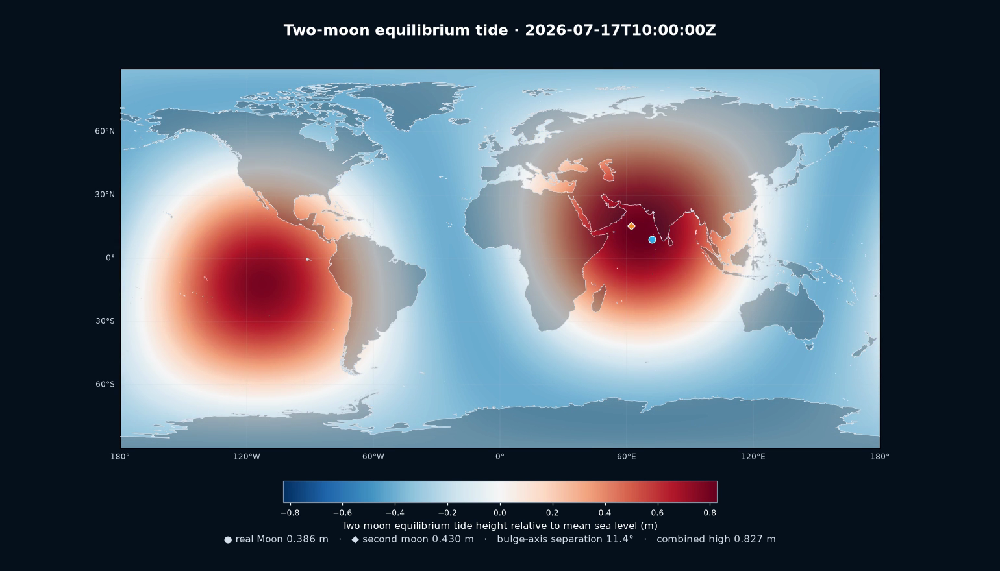

# Chained Eclipse Simulator

[](https://github.com/wiyth00/chained-eclipse-simulator/actions/workflows/ci.yml)
[](https://www.python.org/)
[](LICENSE)



> A reproducible counterfactual-astronomy laboratory: real JPL ephemerides,
> numerical eclipse geometry, coupled N-body dynamics, and a hypothetical
> second moon. This is a scientific simulation—not an astronomical forecast.

This project searches for rapid pairs of solar eclipses involving the real Moon
and a hypothetical second moon.  It uses JPL DE440s ephemerides for the real
Sun, Earth, and Moon, three-dimensional shadow-cone geometry on a rotating
WGS84 Earth, numerical propagation for the second moon, and REBOUND for the
long-term coupled stability experiment.

The central scientific distinctions are deliberate:

- The **eclipse search** is an ephemeris-forced restricted model.  DE440s
  prescribes the real bodies and the added moon does not perturb them.
- The **baseline coupled model** is a self-consistent counterfactual four-body
  REBOUND integration initialized from DE440s. It includes the added moon's
  calculated mass, so the real Moon and Earth cannot remain on their DE440s
  trajectories.
- The **enhanced coupled model** adds all seven other major planets, Earth J2,
  REBOUNDx first-post-Newtonian gravity and a coupled tidal-spin model. It also
  integrates a matched massless-second-moon control to isolate the alternate
  Earth's attitude from the real-Earth orientation already represented by
  Skyfield.

These models answer different questions; none is silently treated as an exact
continuation of the real Solar System after the July 10, 2026 epoch.

## Headline result

Under the optimized enhanced configuration, an observer at 82.6859° N,
98.5547° W receives two separate totalities on 2026-08-12. The hypothetical
moon reaches maximum at 15:01:19 UTC; the real Moon follows at 20:20:35 UTC,
5 h 19 min 16 s later. Their central tracks pass within 9.82 km.

The 30-year enhanced run catalogs 695 solar and lunar eclipses while exposing
a large secular inclination exchange between the moons. The companion tide
visualization finds a strongest sampled two-moon equilibrium high of 0.827 m;
that is a tide-potential proxy, not a coastal water-level prediction.

See [Scientific results](docs/RESULTS.md) for the executed-run summary,
validation status, limitations, and release artifacts.

## Quick start

```bash
uv sync --all-extras --no-editable
uv run chained-eclipse --mode full
```

The first run downloads `de440s.bsp` into `data/ephemeris/`.  Results are
written under `outputs/`, including CSV/JSON data, an optimized configuration,
maps, timelines, diagnostic plots, a stability plot, and an HTML technical
report.

Large generated artifacts are intentionally excluded from Git history. The
reference movies and executed-run bundle are attached to the
[latest GitHub release](https://github.com/wiyth00/chained-eclipse-simulator/releases/latest).

## Reproducible modes

```bash
# Validate the real-Moon model against NASA/GSFC reference circumstances.
.venv/bin/chained-eclipse --mode validate

# Design the earliest deliberately aligned configuration.
.venv/bin/chained-eclipse --mode design

# Propagate the saved configuration without redesigning it per eclipse.
.venv/bin/chained-eclipse --mode fixed

# Run the 1,000-year coupled stability experiment.
.venv/bin/chained-eclipse --mode stability

# Render the solved 2026 event as a two-scale 3-D H.264 movie.
.venv/bin/python -m chained_eclipse.animation \
  --output outputs/animations/chained_eclipse_20260812_3d.mp4 \
  --frames 721 --fps 24 --lead-minutes 12 --trail-minutes 12 --dpi 140

# Render the detailed equirectangular shadow-footprint movie.
.venv/bin/python -m chained_eclipse.animation_2d \
  --output outputs/animations/chained_eclipse_20260812_2d_map.mp4
```

## 3-D animation

The movie combines a close view of the rotating WGS84 Earth and physical core
shadow cones with a true-centre orbital view.  Sun, Earth, and real-Moon states
come from DE440s; the second moon is re-integrated with the same DOP853,
Earth-J2, prescribed-Sun/Moon model used by the eclipse search.  The moon
markers in the wide view are enlarged so they remain visible, but their centre
positions, the Earth, shadow axes, and cone opening angles are physically
scaled.  The close camera follows the Greenland/Iceland corridor containing
the best common observing site.

## 2-D shadow map animation

The equirectangular North Atlantic map recomputes instantaneous topocentric
disk overlap on a 0.25-degree WGS84 grid for every frame.  It shows the true
partial-eclipse footprints, total/central cells, moving center points, recent
centerline trails, Earth day/night shading, and the common observing site over
detailed Natural Earth 50 m coastlines and borders.  The blue and orange
footprints can overlap because the two partial phases genuinely overlap even
though the two periods of totality at the common site are separate.

## Later standalone second-moon eclipses

Continue the exact saved fixed system without redesigning the orbit:

```bash
.venv/bin/python -m chained_eclipse.standalone \
  --start 2026-08-13T00:00:00Z --end 2027-08-13T00:00:00Z

.venv/bin/python -m chained_eclipse.standalone_map \
  --grid-step-deg 0.1 --time-step-seconds 30
```

The first command enumerates standalone second-moon eclipses into JSON and
CSV.  The second produces the detailed ground track for the first later
central eclipse, including maximum-obscuration shading, the annularity band,
centerline, and greatest-eclipse point.

Plot all five total-eclipse centerlines from the May–July 2027 eclipse season:

```bash
.venv/bin/python -m chained_eclipse.total_tracks_2027
```

Zoom eclipse number four onto the United States and calculate Atlanta's exact
topocentric circumstances:

```bash
.venv/bin/python -m chained_eclipse.eclipse4_atlanta
```

These two one-off analyses are intentionally not installed as console
scripts; run them with `python -m` as shown.

Run the unit and reference tests with:

```bash
.venv/bin/pytest
```

## Precision statement

Real-eclipse timing and centerline coordinates are checked against detailed
NASA/GSFC Besselian-element pages.  Results for the hypothetical moon inherit
the verified geometric solver but not the observational precision of a real
ephemeris.  Long-horizon fixed-system event times are model predictions and
are sensitivity-tested; they are not astronomical forecasts.

## Fully coupled eclipse mode

The saved orbit can also be propagated in the self-consistent REBOUND
Sun–Earth–real-Moon–second-moon model, then searched directly for eclipses:

```bash
.venv/bin/python -m chained_eclipse.coupled_eclipse
.venv/bin/python -m chained_eclipse.coupled_figures
```

This baseline mode allows the second moon's calculated mass to perturb Earth
and the real Moon. It retains the exact saved initial state but does not retain
DE440s after the epoch. Results are written under `outputs/coupled/`. The
four-body control deliberately omits major planets, Earth J2, tides,
relativity, and lunar figure terms. In this mode the August 12 chain survives,
but moves to the Canadian high Arctic and widens to 5 hours 18 minutes 44
seconds; the earlier restricted-model Atlanta prediction does not survive.

## Lunar eclipses in the two-moon sky

Search for either moon passing through Earth's penumbra and umbra inside the
same coupled trajectory:

```bash
.venv/bin/python -m chained_eclipse.lunar_eclipse
```

The catalog is written under `outputs/coupled/lunar_eclipses/`. The visually
closest early pairing occurs on 2026-07-30: the second moon is totally eclipsed
for about 95 minutes while the nearly full real Moon sits only 7.35 degrees
away in the sky.

## Thirty-year eclipse climate

Propagate the fully coupled system through 2056, catalog every solar and lunar
eclipse, and render the inclination exchange and annual event rates:

```bash
.venv/bin/python -m chained_eclipse.eclipse_climate
.venv/bin/python -m chained_eclipse.climate_tracks
```

The first command writes the complete 2026-2056 catalog, notable-event table,
inclination samples, annual counts, and eclipse-climate chart under
`outputs/coupled/eclipse_climate_30y/`. The second plots the four longest
sampled total-solar-eclipse tracks from each moon. The default trajectory uses
one-hour interpolation knots and a ten-minute event scan; a five-minute scan
recovers the same 696-event catalog with no classification differences.

This counterfactual run exhibits a regular secular inclination exchange, not a
demonstrated chaotic instability. Near 2040 the real Moon's inclination falls
below one degree while the second moon approaches 19.5 degrees; their eclipse
rates respond in opposite directions. Long-range ground coordinates remain
conditional because this baseline catalog omits tides, major planets, Earth
J2, relativity, and a self-consistent alternate-Earth rotation history.

## Enhanced dynamics mode

The enhanced climate run keeps the same optimized epoch state but replaces the
four-body control with a higher-fidelity counterfactual integration:

- Mercury and Venus are active planet-centre point masses. Mars through
  Neptune are active planetary-system barycentres with matching DE440 system
  gravitational parameters, so their unmodeled satellites are included in the
  system mass rather than silently discarded. Together with Earth, all eight
  major planets are active. Pluto is optional in the Python API and is off by
  default.
- DE440s supplies every real body's BCRS/ICRF state at the epoch only. After
  that instant, the Sun, planets, Earth and both moons evolve freely and
  self-consistently under REBOUND IAS15.
- REBOUNDx `gravitational_harmonics` applies Earth's J2 quadrupole using the
  configured equatorial radius and spin direction.
- REBOUNDx `gr_full` applies full first-order post-Newtonian interactions among
  all active bodies. This is materially stronger than a Sun-only Schwarzschild
  correction, but it still omits higher PN orders, frame dragging and the solar
  quadrupole.
- REBOUNDx `tides_spin` treats Earth as the deformable, spinning body and the
  other active bodies as point-mass tide raisers. Its constant time lag is
  normalized to reproduce 38.2 mm/year of circular real-Moon recession at
  384,400 km, and Earth's three-component spin vector is evolved inside the
  same N-body integration.

REBOUND and REBOUNDx are constrained to the compatible `>=4.6,<5.0` API range
in `pyproject.toml`. The quick-start install includes both packages and the
project's command-line entry points.

## Thirty-day two-moon tide animation

Render the direct interference of the real and hypothetical lunar tidal bulges:

```bash
.venv/bin/python -m chained_eclipse.tide_visualization
```

The equirectangular movie uses the enhanced N-body trajectory and evaluates the
exact tide-generating potential on a global one-degree grid every hour. The
usual degree-2 amplitudes are retained as per-frame diagnostics, while the map
also captures the small near-side/far-side asymmetry of the close second moon.
The plotted height is an instantaneous equilibrium open-ocean proxy. It is not a
coastal water-level forecast: the deliberately transparent model omits the solar
tide, continents, bathymetry, ocean inertia, resonance, friction, loading, and
self-attraction. A companion CSV and JSON manifest retain every frame's moon
subpoints, distances, individual amplitudes, bulge alignment, and global extrema.

### Differential Earth attitude

Ground longitude cannot remain tied to the real Earth's rotation after adding
a massive second moon. The enhanced trajectory therefore performs two matched
integrations:

1. the full system with the second moon's calculated mass; and
2. a control with the same epoch, planets, J2, `gr_full`, and `tides_spin`, but
   with the second moon's mass set to zero.

The difference in their integrated Earth spin phase and spin-pole direction is
composed onto Skyfield's standard ITRS orientation. This retains the real-Earth
UT1/precession/nutation model as the zero-order reference while adding only the
counterfactual perturbation attributed to the second moon. It is a differential
attitude model, not a newly fitted future Earth-orientation series.

### Run, map, and compare

Generate the enhanced 2026–2056 catalog and climate plot:

```bash
.venv/bin/python -m chained_eclipse.eclipse_climate \
  --dynamics-model enhanced \
  --output-dir outputs/coupled/eclipse_climate_30y_enhanced
```

Recompute the standout total-eclipse tracks with that same enhanced trajectory:

```bash
.venv/bin/python -m chained_eclipse.climate_tracks \
  --climate outputs/coupled/eclipse_climate_30y_enhanced/climate.json
```

Compare the baseline and enhanced catalogs event by event:

```bash
.venv/bin/python -m chained_eclipse.enhanced_comparison \
  outputs/coupled/eclipse_climate_30y/climate.json \
  outputs/coupled/eclipse_climate_30y_enhanced/climate.json \
  --output-dir outputs/coupled/eclipse_climate_30y_enhanced/comparison \
  --max-match-days 7
```

The comparator performs one-to-one nearest-time matching separately for solar
and lunar eclipses from each moon. It writes `comparison.json`,
`matched_events.csv`, and a static plot of timing and global-maximum-point
displacements. It also reports added/removed events, type changes, count deltas,
and changes to rapid-pair and chained-eclipse classifications.
The seven-day assignment window is short enough to avoid cross-pairing adjacent
second-moon eclipse cycles late in the run. `added` and `removed` mean unmatched
inside that window; they are not automatically literal births or disappearances
of physical eclipses, especially for grazing partial and penumbral events.

Build the result-first enhanced Markdown and HTML report, including both saved
convergence comparisons and the original published-eclipse validation:

```bash
.venv/bin/python -m chained_eclipse.enhanced_report \
  --validation outputs/validation_report.json \
  --convergence outputs/coupled/eclipse_climate_30y_enhanced/convergence_detector_300s/comparison.json \
  --convergence outputs/coupled/eclipse_climate_30y_enhanced/convergence_trajectory_1y_1800s/comparison.json
```

The standalone secular tidal-magnitude audit is reproducible with:

```bash
.venv/bin/python -m chained_eclipse.tides_spin \
  --output-dir outputs/coupled/tidal_spin_audit
```

### Trajectory cache

Enhanced propagation is the expensive step because the full system and its
massless-second-moon attitude control must both be integrated. By default,
`EnhancedEphemeris` stores a compressed, content-addressed trajectory at:

```text
data/trajectories/enhanced_<20-character-sha256-prefix>.npz
```

The cache contains the sampled Sun/Earth/two-moon positions, full and control
Earth-spin vectors, and the Newtonian energy diagnostic. Its key includes the
orbital elements, end time, trajectory cadence, IAS15 tolerance, J2/relativity
and tide settings, Pluto toggle, force-model schema, and DE440s kernel name,
size, and modification time. Detector cadence is intentionally excluded
because it consumes but does not alter the trajectory. Repeating a climate or
track run with the same trajectory settings loads the cached arrays; changing
a keyed physical setting creates a different file instead of overwriting the
old integration.

Programmatic callers can set `cache_trajectory=False` or provide
`trajectory_cache_dir` to `EnhancedEphemeris`. If the force implementation or
REBOUND/REBOUNDx build changes without a cache-schema change, remove the
corresponding cached file before treating the rerun as independent; source and
library binaries themselves are not hashed into the key.

### Scientific limits of the enhanced run

The enhanced mode narrows the largest omissions, but it does not turn the
hypothetical system into a high-precision astronomical forecast:

- DE440s is an epoch initializer, not a continuing constraint or a refitted
  ephemeris for a Solar System containing the second moon.
- The planets are point masses; Mars through Neptune are system barycentres.
  Asteroids, trans-Neptunian objects, Pluto by default, and planetary figure
  terms other than Earth J2 are omitted.
- Earth J2 has a fixed coefficient and radius. Lunar and second-moon permanent
  figures, libration, deformation, and tides raised inside either moon are not
  modeled.
- `tides_spin` is a constant-time-lag equilibrium-tide approximation calibrated
  at the present lunar orbit. It is not a frequency-dependent ocean and
  solid-Earth tide model, and it omits changing Earth inertia and
  atmosphere/ocean angular momentum exchange.
- The differential attitude overlay is physically motivated but is not an
  observational UT1 or polar-motion prediction. J2 reaction torque, free
  nutation, and a fully refitted alternate-Earth orientation solution remain
  outside the model.
- Relativity stops at first post-Newtonian order. Solar frame dragging, the
  solar quadrupole, and higher-order terms are omitted.
- REBOUND's ordinary `Simulation.energy()` is only a Newtonian diagnostic here:
  it excludes the J2/1PN Hamiltonian contributions, while tides are genuinely
  dissipative. Its drift must not be labeled total energy error.
- Eclipse geometry still omits lunar limb topography and atmospheric
  enlargement of Earth's shadow during lunar eclipses. Grazing classifications
  remain more cadence-sensitive than central events.

Accordingly, late ground tracks and contact times are predictions of this
stated counterfactual model. The baseline-versus-enhanced comparison is the
right way to measure their model sensitivity; neither catalog is an
observational forecast for the real Earth.
